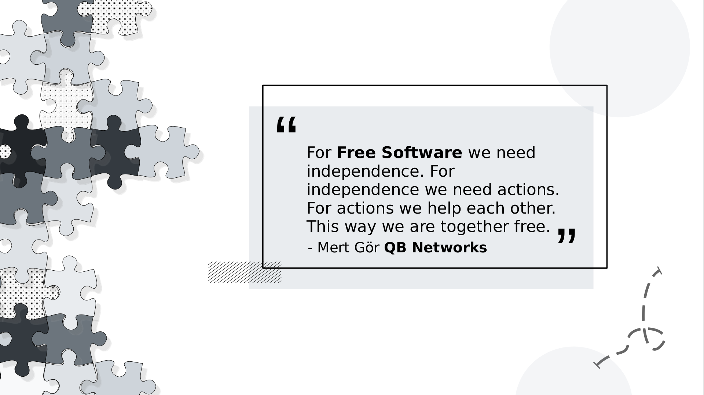

# massCON2026

QB Networks & Masscollabs Services Conferences

We QB Networks and Masscollabs Services are leading to Software, Hardware and Science for the Internet Cyberspace with our own consciousness. We have our own roadmap and which is why we say we are a Free Software project. This is an open way to software and open infrastructures ...

QB Networks is a Free Software company which is holding and maintaining [Masscollabs Services](https://www.masscollabs.xyz) and its subprojects ...

## The four essential freedoms

A program is free software if the program's users have the four essential freedoms: 

* The freedom to run the program as you wish, for any purpose (freedom 0).

* The freedom to study how the program works, and change it so it does your computing as you wish (freedom 1). Access to the source code is a precondition for this.

* The freedom to redistribute copies so you can help others (freedom 2).

* The freedom to distribute copies of your modified versions to others (freedom 3). By doing this you can give the whole community a chance to benefit from your changes. Access to the source code is a precondition for this.

## Our approach to sponsors and partners

We ofcourse like to be partners with sponsors or other organizations that who want to get in touch with us. But our choice is "Free Software Business Model" and we only accept organizations for sponsorship who will write Free Software with us. And also we only accept organizations that we can give technical support and other Free Software services to them...

Thanks for your understanding.

happy hacking !

## Security & Abuse Team

We have been initialized our Abuse Team Email and it is abuse at qbnetworks dot xyz and our GPG Key ID: 0xA45FAA3685170E38 for encrypted emails.

QB Networks Abuse Technical Support Account

Run Free Software and Please do stay safe

happy hacking !

## License

Masscollabs Conferences

Copyright (C) 2024-2026 QB Networks

Copyright (C) 2017-2026 Masscollabs Services

Copyright (C) 2017-2026 PSD Authors

Copyright (C) 2017-2026 Mass Collaboration Labs

This program is free software: you can redistribute it and/or modify
it under the terms of the GNU Affero General Public License as published
by the Free Software Foundation, either version 3 of the License, or
(at your option) any later version.

This program is distributed in the hope that it will be useful,
but WITHOUT ANY WARRANTY; without even the implied warranty of
MERCHANTABILITY or FITNESS FOR A PARTICULAR PURPOSE.  See the
GNU Affero General Public License for more details.

You should have received a copy of the GNU Affero General Public License
along with this program.  If not, see <https://www.gnu.org/licenses/>.

Feel free to send an email for your questions to mertgor at qbnetworks dot xyz
